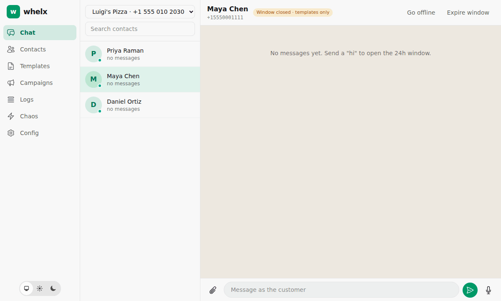

<h1 align="center">whelx</h1>

<p align="center"><strong>Stop texting your own phone to test your WhatsApp bot.</strong></p>

<p align="center">
  A local, 1:1 fake of Meta's WhatsApp Cloud API: same endpoints, same JSON, same error codes, signed webhooks,<br/>
  plus a WhatsApp Web–style chat where <strong>you</strong> play the customer.
</p>

<p align="center">
  <a href="README.pt-BR.md">🇧🇷 Leia em português</a>
</p>

<p align="center">
  
</p>

```bash
docker run -p 4000:4000 ghcr.io/carvalhosauro/whelx
```

Point your app at `http://localhost:4000` instead of `https://graph.facebook.com`, open http://localhost:4000 and say hi.

---

## Why

Testing a WhatsApp bot today means a Meta app, a test number, an ngrok tunnel, texting yourself and hoping the webhook arrives. Reproducing a `131047` (24h window closed) means waiting 24 hours. Load-testing a campaign risks getting a real number flagged.

whelx runs the whole Cloud API on your laptop. Your app doesn't know the difference.

| | Meta test number | Hand-written mocks (WireMock etc.) | **whelx** |
|---|---|---|---|
| Needs a Meta account, app and number | yes | no | **no** |
| Real signed webhooks (`X-Hub-Signature-256`) | yes, via a tunnel | no | **yes** |
| Statuses `sent → delivered → read → failed` | yes, uncontrolled | hand-written | **yes, controllable** |
| Real errors (`130429`, `131047`, `132001`, `131056`…) | hard to trigger | made up | **on demand** |
| 80 msg/s per-number throughput | real, risky to test | no | **emulated** (200 requests → 80 accepted, 120 × `130429`) |
| 24h customer service window | wait 24h | no | **expire it in one click** |
| Chaos: dropped, duplicated, out-of-order webhooks | no | no | **yes, deterministic by seed** |
| Driven by a coding agent (MCP) | no | no | **yes** |
| Cost and risk | paid conversations, number can be flagged | free, but drifts from reality | **free and local** |

## What's inside

- **Fake Graph API** at `/vNN.N/...`, any version: messages (text, template, interactive button/list/CTA URL/`order_details`), read receipts with typing indicator, templates (create, list with cursor paging, delete, review), media (`GET /{media_id}` and download), resumable uploads, WABAs, phone numbers and `subscribed_apps` (with per-WABA and per-number callback overrides).
- **Signed webhooks** for incoming messages and statuses, in Meta's current (v24+) shape. They retry with backoff, and every delivery is logged with payload, signature and response.
- **Chat UI** where you are the customer: text, voice notes recorded in the browser, images and documents, location, reactions, tapping buttons and list rows, and a Pix order card. Every message can be inspected as raw JSON next to the webhooks it produced.
- **Campaigns dashboard**: template sends grouped by name, msg/s, status progression and rate-limit hits.
- **Control API** (`/_whelx/*`) and an **MCP server** (`/_whelx/mcp`), so tests and coding agents can play the customer and wait for your bot's reply.
- **Deterministic chaos**: latency, synchronous errors, asynchronous failures, and dropped, duplicated, reordered or batched webhooks. It can be global or scoped to specific numbers.

## Faithful to Meta

- Success is HTTP 200 with `messages[0].id` (`wamid.…`). `message_status: "accepted"` appears only on template sends.
- Errors use Meta's envelope: `{"error": {message, type, code, error_subcode, error_user_msg, error_data, fbtrace_id}}`. Unknown objects return `code 100 / subcode 33`, `GraphMethodException`.
- **24h window:** a free-form message outside the window returns 200, then a `failed` status webhook with `131047`, just like production.
- **Templates:** a template that is missing or not approved returns `132001`. A parameter count mismatch returns `132000`. A duplicate name and language returns `2388024`.
- **Limits:** per-number throughput returns `130429` (HTTP 400). The optional pair rate limit (same customer, burst 45, then 1 message per 6s) returns `131056`.
- **Status webhooks:** no `conversation` object (v24+), PMP `pricing`, `errors[].href`.
- **`order_details`:** validated against Meta's rules. The items must add up to the subtotal; the total must equal subtotal + tax + shipping − discount; `reference_id`, `retailer_id` and Pix keys are checked.
- Anything whelx doesn't emulate yet returns `code 100` with `whelx: not supported`, never a silent success.

## Use it with your app

1. Make the Graph API base URL configurable in your app (usually the only code change).
2. Copy the `.env` block from the **Config** page: base URL, app secret, verify token, access token, WABA id and phone number id.
3. Set your webhook URL in **Config** and click **Verify webhook**.

Full walkthrough, including Docker Compose, campaigns and chaos: [docs/testing-your-app.md](docs/testing-your-app.md).

### Drive it from tests or CI

```bash
# the customer says hi
curl -s -X POST localhost:4000/_whelx/contacts/15550001111/messages \
  -H 'content-type: application/json' -d '{"type":"text","text":"hi"}'

# wait for your bot's reply (no sleeps)
curl -s -X POST localhost:4000/_whelx/wait -H 'content-type: application/json' \
  -d '{"kind":"outbound_message","contact":"15550001111","timeout_ms":30000}'
```

| Endpoint | What it does |
|---|---|
| `POST /seed` | declarative, idempotent scenario (`app`, `wabas[].phone_numbers`, `tokens`, `contacts`, `templates`, `settings`, `chaos`) |
| `POST /reset?keep=contacts,templates` | wipe test data, keep configuration |
| `GET`/`PUT /config` · `POST /tokens` | app, settings, access tokens |
| `GET`/`PUT /chaos` | chaos profile (`{"preset":"flaky"}` or fields; `phone_number_ids` to scope it) |
| `/contacts` · `POST /contacts/bulk` | fake customers (behaviour: normal, invalid number, blocked; online or offline; read policy) |
| `POST /contacts/:wa_id/messages` | the customer sends text, location, reaction, image, audio or document |
| `POST /contacts/:wa_id/reply-interactive` | the customer taps a button, list row or quick reply (`{wamid, id}`) |
| `GET /messages` · `GET /conversations/:id` | inspect traffic (`/open`, `/expire-window`) |
| `POST /templates/:id/approve` · `/reject` | template review |
| `GET /webhooks/deliveries` · `POST .../redeliver` · `POST /webhooks/verify` | webhook log, redelivery, handshake |
| `GET /requests` | every Graph API call your app made (tokens masked) |
| `POST /wait` | long-poll for a reply, a status or a webhook delivery |

### Let your coding agent test it

```bash
claude mcp add --transport http whelx http://localhost:4000/_whelx/mcp
```

Tools: `seed`, `reset`, `get_config`, `env_block`, `send_as_contact`, `reply_interactive`, `wait_for`, `list_messages`, `list_contacts`, `set_contact`, `bulk_contacts`, `list_templates`, `approve_template`, `reject_template`, `set_chaos`, `list_webhook_deliveries`, `redeliver_webhook`, `verify_webhook`, `expire_window`.

## Configuration

| Variable | Default | Purpose |
|---|---|---|
| `PORT` | `4000` | HTTP port |
| `BIND_IP` | `0.0.0.0` in Docker, `127.0.0.1` in dev | interface to bind |
| `WHELX_PUBLIC_URL` | `http://localhost:$PORT` | base of media and paging URLs; must be reachable by your app |
| `DATA_DIR` | `/data` in Docker | SQLite database and media files (mount a volume to persist) |
| `SECRET_KEY_BASE` | random per boot | only signs UI sessions |

## Development

```bash
mix setup
mix phx.server          # http://localhost:4000
mix test
python3 scripts/smoke.py --base http://localhost:4000   # end-to-end, acts as a client app (resets data)
```

Built with Elixir, Phoenix LiveView, SQLite and Oban.

## Security

whelx is a local test tool. The UI and the control API have **no authentication** (they reject cross-site requests), and the Config page shows your app secret. Don't expose the port to a network you don't trust.

---

<p align="center">
  Inspired by <a href="https://github.com/floci-io/floci">floci</a>, which does the same for AWS.<br/>
  Not affiliated with, endorsed by, or sponsored by Meta. WhatsApp is a trademark of Meta Platforms, Inc.<br/>
  ⭐ Star the repo if it saved you from texting yourself.
</p>
